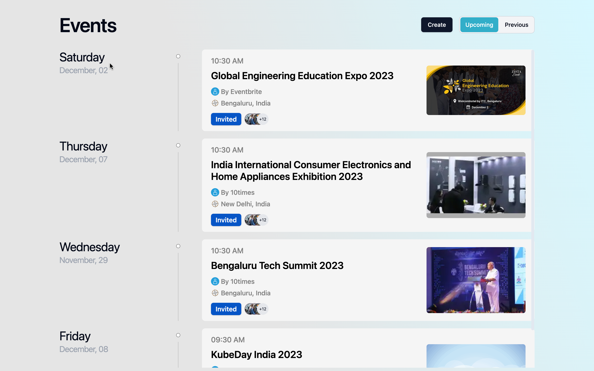
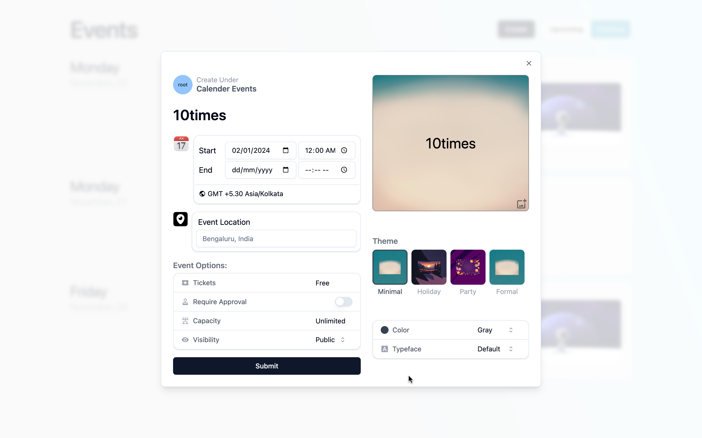

<a name="readme-top"></a>

<!-- PROJECT LOGO -->
<br />
<div align="center">

  <a href="https://github.com/sarkartanmay393/EventHub-React">
    
  </a>

<h3 align="center">Events Manager: EventHub</h3>

[![Contributors][contributors-shield]][contributors-url]
[![Forks][forks-shield]][forks-url]
[![Stargazers][stars-shield]][stars-url]
[![Issues][issues-shield]][issues-url]
[![LinkedIn][linkedin-shield]][linkedin-url]

<p align="center">
   Your go-to platform for seamless event management! Whether you're organizing, discovering, or attending events, we've got you covered. Effortlessly create and promote events, explore a curated list of upcoming happenings, and connect with a community of event enthusiasts.

   <br />
   <a href="https://github.com/sarkartanmay393/EventHub-React"><strong>Explore Code »</strong></a>
   <br />
   <br />
   <a href="https://eventsmanager-10times.vercel.app/" target="_blank" rel="noopener noreferrer" >View Demo</a>
   ·
   <a href="https://github.com/sarkartanmay393/EventHub-React/
issues">Report Bug</a>
   ·
   <a href="https://github.com/sarkartanmay393/EventHub-React/
issues">Request Feature</a>
 </p>

</div>

<!-- TABLE OF CONTENTS -->
<details>
  <summary>Table of Contents</summary>
  <ol>
    <li>
      <a href="#about-the-project">About The Project</a>
      <ul>
        <li><a href="#built-with">Built With</a></li>
      </ul>
      <ul>
        <li><a href="#things-i-learned">Things I Learned</a></li>
      </ul>
      <ul>
        <li><a href=“#screenshots">Screenshots</a></li>
      </ul>
    </li>
    <li>
      <a href="#getting-started">Getting Started</a>
      <ul>
        <li><a href="#prerequisites">Prerequisites</a></li>
        <li><a href="#steps-to-run">Steps to run</a></li>
      </ul>
    </li>
    <li><a href="#roadmap">Roadmap</a></li>
    <li><a href="#contributing">Contributing</a></li>
    <li><a href="#contact">Contact</a></li>
  </ol>
</details>

<!-- ABOUT THE PROJECT -->

## About The Project

### Built With

1. Reactjs
2. Shancd/ui
3. Tailwind
4. React Hook Form

### Things I Learned

1. Everything of Basic Web App.
2. Complexiities of Vite
3. Shadcn UI

### Screenshots

<details>
  <summary><strong>Show</strong> </summary>
  <div style="text-align: center;"> <strong><i>EventHub Home</i></strong></div>

  

  <div style="text-align: center;"> <strong><i>EventHub Modal</i></strong></div>
  
  
</details>

<p align="right">(<a href="#readme-top">back to top</a>)</p>

<!-- GETTING STARTED -->

## Getting Started

Running a development environment for this project will be the easiest thing in you day.

### Prerequisites

- [**NPM**](https://npmjs.com)

### Steps to run

- Clone the repository

  ```zsh
  git clone https://github.com/sarkartanmay393/EventHub-React.git
  ```

- Run the following command to start

  ```zsh
  npm install
  npm run dev
  ```

<br />

> If any issue occured while installing node modules, just delete the `/node_modules` and reinstall.

<p align="right">(<a href="#readme-top">back to top</a>)</p>

<!-- ROADMAP -->

## Roadmap

- [x] React UI
- [x] Styling w/ Shadcn UI
- [x] Styling w/ Tailwind
- [x] New Responsive UI
- [ ] Real Project Transformation

See the [open issues](https://github.com/sarkartanmay393/EventHub-React/issues) for a full list of proposed features (and known issues).

<!-- CONTRIBUTING -->

## Contributing

Contributions are what make the open source community such an amazing place to learn, inspire, and create. Any contributions you make are **greatly appreciated**.

If you have a suggestion that would make this better, please fork the repo and create a pull request. You can also simply open an issue with the tag "enhancement".
Don't forget to give the project a star! Thanks again!

1. Fork the Project
2. Create your Feature Branch (`git checkout -b feature/AmazingFeature`)
3. Commit your Changes (`git commit -s -m 'Add some AmazingFeature'`)
4. Push to the Branch (`git push origin feature/AmazingFeature`)
5. Open a Pull Request
6. Wait for review

<!-- CONTACT -->

## Contact

Your Name - Tanmay Sarkar [@sarkartanmay393](https://twitter.com/sarkartanmay393) - [hello@tanmaysarkar.tech](mailto:sarkartanmay393@gmail.com)

Project Link: [https://github.com/sarkartanmay393/EventHub-React](https://github.com/sarkartanmay393/EventHub-React)

**Thanks for visiting my project. If you like it, please give it a star. It will help me a lot. Thanks again!**

<p align="right">(<a href="#readme-top">back to top</a>)</p>

<!-- MARKDOWN LINKS & IMAGES -->
<!-- https://www.markdownguide.org/basic-syntax/#reference-style-links -->

[contributors-shield]: https://img.shields.io/github/contributors/sarkartanmay393/EventHub-React.svg?style=for-the-badge
[contributors-url]: https://github.com/sarkartanmay393/EventHub-React/graphs/contributors
[forks-shield]: https://img.shields.io/github/forks/sarkartanmay393/EventHub-React.svg?style=for-the-badge
[forks-url]: https://github.com/sarkartanmay393/EventHub-React/network/members
[stars-shield]: https://img.shields.io/github/stars/sarkartanmay393/EventHub-React.svg?style=for-the-badge
[stars-url]: https://github.com/sarkartanmay393/EventHub-React/stargazers
[issues-shield]: https://img.shields.io/github/issues/sarkartanmay393/EventHub-React.svg?style=for-the-badge
[issues-url]: https://github.com/sarkartanmay393/EventHub-React/issues
[linkedin-shield]: https://img.shields.io/badge/-LinkedIn-black.svg?style=for-the-badge&logo=linkedin&colorB=555
[linkedin-url]: https://linkedin.com/in/tanmaysrkr
